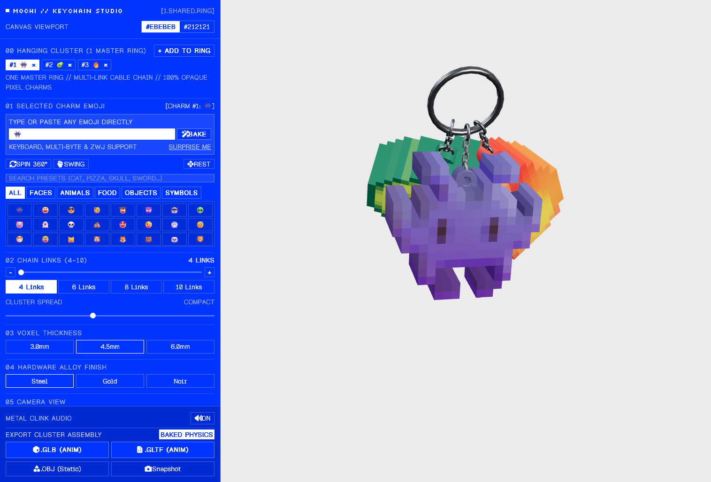

# 🍡 Mochi — 3D Pixel-Art Keychain Studio

> Mochi is a simple interactive tool that turns emojis into 3D pixel-art keychains.

  

---

## 💡 What is Mochi?

**Mochi** is a web-based 3D studio that transforms any 2D emoji into a tactile, retro-styled voxel charm suspended on a physical keychain assembly. 

Whether it's a smiley face, animal, food item, or a complex multi-byte/ZWJ emoji (like 🥷, ❤️‍🔥, or 🏴‍☠️), Mochi parses the character, voxelizes its color palette, molds it into a 3D pixel block, and attaches it with mechanical jump rings to a shared master ring.

### Key Highlights:
- **Instant Voxelization**: Rasterizes and extrudes any emoji into solid, colorful 3D pixel geometry.
- **Multi-Charm Cluster**: Attach up to 5 individual charms on a single master split ring.
- **Physical Dynamics**: Interactive natural pendulum swing, 360° spin inertia, and soft collision repulsion accompanied by synthesized metallic chimes.
- **Custom Hardware Finishes**: Choose between Steel, Gold, and Noir alloy finishes with adjustable link counts (4–10 links) and cluster fanning spread.
- **Ready-to-Use 3D Exports**: Export animated models (.GLB and .GLTF) with baked swing physics loops, static .OBJ models, or high-resolution PNG snapshots.

---

## 🕹️ How to Use It

1. **Pick or Enter an Emoji**:
   - Type or paste any emoji into the text field in the left panel and click **Bake**, or click **Surprise Me** for inspiration.
   - You can also browse and search through dozens of categorized presets (Faces, Animals, Food, Objects, Symbols).

2. **Manage Your Keychain Cluster**:
   - Click **+ Add To Ring** to attach extra charms (up to 5 charms per master ring).
   - Switch between charms by clicking their tag in the **00 Hanging Cluster** list, or click **×** to remove one.

3. **Customize the Hardware & Charms**:
   - **Chain Links (4–10)**: Use the slider, `+`/`-` stepper buttons, or preset chips to adjust the chain length for the selected charm.
   - **Cluster Spread**: Adjust the slider from compact to wide to control how the charms fan out.
   - **Voxel Thickness**: Select 3.0mm, 4.5mm, or 6.0mm molded thickness.
   - **Alloy Finish**: Choose your metal style: **Steel**, **Gold**, or **Noir**.

4. **Interact in 3D**:
   - **Orbit & Pan**: Click and drag on empty viewport space to orbit the camera; scroll to zoom in/out.
   - **Fling & Grab**: Click directly on any charm or ring and drag to swing or spin the cluster with momentum.
   - **Motion Controls**: Use **Spin 360°**, **Swing**, or **Rest** to trigger natural physics motions.
   - **Camera Views**: Click **Front**, **Angle**, or **Master Ring** to jump to preset camera angles.

5. **Export Your Creation**:
   - **.GLB (Anim)**: Download a binary glTF file with baked 3.2s looping swing animation.
   - **.GLTF (Anim)**: Download a JSON glTF model with embedded animation keyframes.
   - **.OBJ (Static)**: Export clean static geometry for 3D modeling or 3D printing.
   - **Snapshot**: Capture a high-resolution PNG image directly from the canvas.